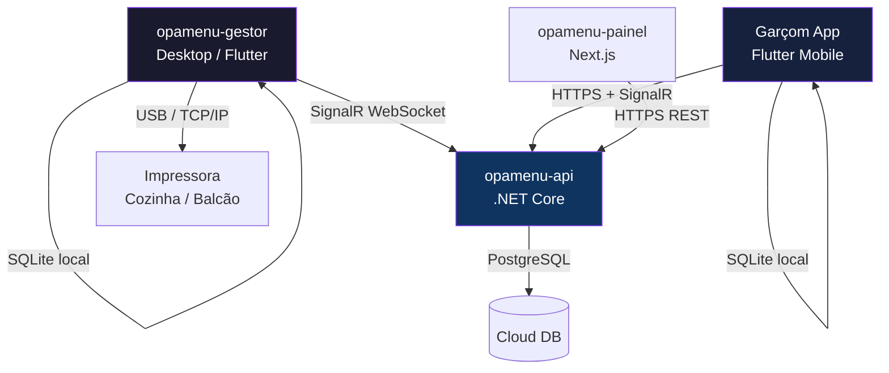

# Arquitetura Híbrida – Opamenu Gestor

> **Versão:** 1.0 · **Atualizado:** 2026-02-22  
> Documento de referência para as três grandes iniciativas de evolução do **opamenu-gestor**:  
> PDV Offline-First, Servidor de Impressão Centralizado e Mapa de Mesas com Comandas.

---

## 1. Visão Geral



| Componente | Plataforma | Função Primária |
|---|---|---|
| `opamenu-gestor` | Flutter Desktop (Windows) | PDV, Servidor de Impressão, Mapa de Mesas |
| `opamenu-api` | .NET Core | Backend REST + Hub SignalR |
| `Garçom App` | Flutter Mobile / Web | Abertura de pedidos offline-first |
| `opamenu-painel` | Next.js | Painel administrativo |

---

## 2. Frente de Caixa (PDV) – Offline-First

### 2.1 Motivação

O PDV deve funcionar **mesmo sem conexão com a internet**. Pedidos de mesa e balcão são criados localmente e sincronizados assim que a conexão for restabelecida.

### 2.2 Banco de Dados Local – SQLite via `drift`

Adicionar ao `pubspec.yaml`:

```yaml
dependencies:
  drift: ^2.20.0
  sqlite3_flutter_libs: ^0.5.0
  path_provider: ^2.1.5       # já presente

dev_dependencies:
  drift_dev: ^2.20.0
  build_runner: ^2.7.1        # já presente
```

### 2.3 Estrutura de Dados Local

```
lib/core/local_db/
├── app_database.dart          # AppDatabase (drift)
├── app_database.g.dart        # gerado
├── tables/
│   ├── local_orders_table.dart
│   ├── local_order_items_table.dart
│   └── sync_queue_table.dart
└── daos/
    ├── local_order_dao.dart
    └── sync_queue_dao.dart
```

#### `local_orders_table.dart`

```dart
import 'package:drift/drift.dart';

class LocalOrders extends Table {
  IntColumn get id => integer().autoIncrement()();
  TextColumn get localId => text()();          // UUID local
  TextColumn get cloudId => text().nullable()();// ID do pedido na nuvem
  TextColumn get tableNumber => text().nullable()();
  TextColumn get status => text()(); // 'pending_sync' | 'synced' | 'error'
  TextColumn get payload => text()(); // JSON completo do pedido
  DateTimeColumn get createdAt => dateTime()();
  DateTimeColumn get updatedAt => dateTime()();
}

class SyncQueue extends Table {
  IntColumn get id => integer().autoIncrement()();
  TextColumn get localOrderId => text()();
  IntColumn get attempts => integer().withDefault(const Constant(0))();
  TextColumn get lastError => text().nullable()();
  DateTimeColumn get nextRetryAt => dateTime()();
}
```

#### `app_database.dart`

```dart
import 'package:drift/drift.dart';
import 'package:drift/native.dart';
import 'package:path_provider/path_provider.dart';
import 'package:path/path.dart' as p;

part 'app_database.g.dart';

@DriftDatabase(tables: [LocalOrders, SyncQueue])
class AppDatabase extends _$AppDatabase {
  AppDatabase() : super(_openConnection());

  @override
  int get schemaVersion => 1;

  static QueryExecutor _openConnection() {
    return LazyDatabase(() async {
      final dir = await getApplicationSupportDirectory();
      final file = File(p.join(dir.path, 'opamenu.db'));
      return NativeDatabase(file);
    });
  }
}
```

### 2.4 Serviço de Sincronização

```
lib/core/sync/
├── sync_service.dart          # Riverpod @riverpod class SyncService
└── connectivity_monitor.dart  # Detecta mudança de rede
```

#### `sync_service.dart` (esqueleto)

```dart
@riverpod
class SyncService extends _$SyncService {
  Timer? _syncTimer;

  @override
  AsyncValue<SyncStatus> build() {
    _startPeriodicSync();
    return const AsyncValue.data(SyncStatus.idle);
  }

  void _startPeriodicSync() {
    _syncTimer = Timer.periodic(
      const Duration(seconds: 30),
      (_) => syncPendingOrders(),
    );
  }

  Future<void> syncPendingOrders() async {
    // 1. Buscar pedidos com status 'pending_sync' no SQLite
    // 2. Para cada pedido, POST /api/orders
    // 3. Na resposta OK → atualizar cloudId e status → 'synced'
    // 4. Em caso de falha → incrementar attempts, agendar retry exponencial
  }
}
```

### 2.5 Fluxo de Criação de Pedido Offline

```
Garçom abre pedido
        │
        ▼
  Tem internet?
   ┌────┴────┐
  Não       Sim
   │          │
   ▼          ▼
Salva no   POST /api/orders
SQLite     (resposta imediata)
status=    │
pending    ▼
_sync    Salva cloudId
         no SQLite
         status=synced
```

---

## 3. Servidor de Impressão Centralizado

### 3.1 Arquitetura

O **Desktop (opamenu-gestor)** conecta-se ao Hub SignalR da API e **escuta eventos** de novos pedidos. Quando um pedido chega, ele gera o ticket ESC/POS e envia para a impressora configurada (USB ou rede).

```
Garçom (mobile) → POST /orders → API → SignalR Hub → Desktop → Impressora
```

### 3.2 Dependências já presentes no `pubspec.yaml`

| Pacote | Versão | Uso |
|---|---|---|
| `signalr_netcore` | ^1.4.4 | Conexão com o Hub da API |
| `flutter_pos_printer_platform_image_3` | ^1.2.4 | Gerenciador de impressão |
| `esc_pos_utils_plus` | ^2.0.4 | Geração de bytes ESC/POS |

### 3.3 Hub SignalR – Lado Servidor (`opamenu-api`)

```csharp
// Hubs/PrintHub.cs
public class PrintHub : Hub
{
    public async Task NotifyNewOrder(PrintJobDto job)
    {
        // Transmite apenas para clientes no grupo do tenant
        await Clients.Group(job.TenantId.ToString())
                     .SendAsync("OnNewOrder", job);
    }
}

// Program.cs
app.MapHub<PrintHub>("/hubs/print");
```

```csharp
// DTOs/PrintJobDto.cs
public record PrintJobDto(
    Guid OrderId,
    string TableNumber,
    string Destination,      // "kitchen" | "bar" | "cashier"
    List<PrintItemDto> Items,
    string? Notes,
    DateTime CreatedAt,
    string TenantId
);
```

### 3.4 Serviço de Impressão – Lado Cliente (`opamenu-gestor`)

```
lib/core/services/
├── printer_service.dart          # já existe – USB/TCP
└── print_hub_service.dart        # NOVO – conexão SignalR
```

#### `print_hub_service.dart`

```dart
import 'package:riverpod_annotation/riverpod_annotation.dart';
import 'package:signalr_netcore/signalr_client.dart';

part 'print_hub_service.g.dart';

@riverpod
class PrintHubService extends _$PrintHubService {
  HubConnection? _connection;

  @override
  void build() {
    _connect();
    ref.onDispose(dispose);
  }

  Future<void> _connect() async {
    _connection = HubConnectionBuilder()
        .withUrl('https://api.opamenu.com.br/hubs/print')
        .withAutomaticReconnect()
        .build();

    _connection!.on('OnNewOrder', _handleIncomingOrder);
    await _connection!.start();
  }

  void _handleIncomingOrder(List<Object?>? args) {
    if (args == null || args.isEmpty) return;
    final job = PrintJobDto.fromJson(args[0] as Map<String, dynamic>);
    ref.read(printerServiceProvider.notifier).printOrderTicket(job);
  }

  Future<void> dispose() => _connection?.stop() ?? Future.value();
}
```

### 3.5 Geração do Ticket ESC/POS

Expandir `printer_service.dart` com o método `printOrderTicket`:

```dart
Future<List<int>> generateOrderTicket(
  PrintJobDto job,
  PaperSize paperSize,
) async {
  final profile = await esc.CapabilityProfile.load();
  final generator = esc.Generator(paperSize.posSize, profile);
  List<int> bytes = [];

  // Cabeçalho
  bytes += generator.text('*** COZINHA ***',
      styles: const esc.PosStyles(
        align: esc.PosAlign.center,
        bold: true,
        height: esc.PosTextSize.size2,
      ));
  bytes += generator.text('Mesa: ${job.tableNumber}',
      styles: const esc.PosStyles(align: esc.PosAlign.center));
  bytes += generator.hr();

  // Itens
  for (final item in job.items) {
    bytes += generator.row([
      PosColumn(text: '${item.qty}x ${item.name}', width: 9),
      PosColumn(
        text: 'R\$ ${item.price.toStringAsFixed(2)}',
        width: 3,
        styles: const esc.PosStyles(align: esc.PosAlign.right),
      ),
    ]);
    if (item.notes != null) {
      bytes += generator.text('  * ${item.notes}',
          styles: const esc.PosStyles(italic: true));
    }
  }

  bytes += generator.hr();

  // Observações gerais
  if (job.notes != null && job.notes!.isNotEmpty) {
    bytes += generator.text('OBS: ${job.notes}',
        styles: const esc.PosStyles(bold: true));
    bytes += generator.hr();
  }

  // Horário
  final time = DateFormat('HH:mm').format(job.createdAt);
  bytes += generator.text('Pedido: $time',
      styles: const esc.PosStyles(align: esc.PosAlign.right));
  bytes += generator.feed(2);
  bytes += generator.cut();

  return bytes;
}
```

### 3.6 Configuração de Impressoras por Destino

```
lib/features/settings/
└── presentation/pages/
    └── printer_settings_page.dart   # interface para mapear destinos
```

Modelo de configuração local:

```dart
/// Salvo em SharedPreferences como JSON
class PrinterConfig {
  final String destination;   // 'kitchen' | 'bar' | 'cashier'
  final PrinterDeviceInfo device;
  final PaperSize paperSize;

  // toJson / fromJson
}
```

---

## 4. Mapa de Mesas e Comandas

### 4.1 Visão da Interface

```
┌─────────────────────────────────────────────────────────────┐
│  Mapa do Salão          [+ Nova Mesa]   [Dividir Conta]      │
├─────────────────────────────────────────────────────────────┤
│                                                              │
│   ╔══╗    ╔══╗    ╔══╗    ╔══╗                              │
│   ║01║    ║02║    ║03║    ║04║                              │
│   ║🟢║    ║🔴║    ║🟡║    ║⚫║                              │
│   ╚══╝    ╚══╝    ╚══╝    ╚══╝                              │
│   Livre   Ocup.  Espera  Reservado                          │
│                                                              │
│  [Zoom +] [Zoom -]   Piso 1 ▼                               │
└─────────────────────────────────────────────────────────────┘
```

### 4.2 Estrutura de Arquivos

```
lib/features/tables/
├── data/
│   ├── models/
│   │   ├── table_model.dart         # já existe
│   │   ├── table_layout_model.dart  # NOVO – posição x/y no mapa
│   │   └── order_summary_model.dart
│   ├── datasources/
│   │   ├── tables_remote_datasource.dart
│   │   └── table_layout_local_datasource.dart   # NOVO – salva posições local
│   └── repositories/
│       └── tables_repository_impl.dart
├── domain/
│   └── models/
│       └── table_entity.dart
└── presentation/
    ├── pages/
    │   ├── table_map_page.dart       # NOVO – Mapa interativo
    │   └── table_orders_page.dart   # lista de pedidos da mesa
    ├── widgets/
    │   ├── table_card_widget.dart   # NOVO – widget arrastável
    │   └── split_bill_dialog.dart   # NOVO – divisão de conta
    └── notifiers/
        ├── table_map_notifier.dart  # NOVO
        └── tables_notifier.dart    # já existe
```

### 4.3 Modelo de Layout

```dart
/// Persistido localmente em SQLite / shared_preferences
class TableLayoutModel {
  final String tableId;
  final double x;         // posição no canvas
  final double y;
  final double width;
  final double height;
  final int floor;        // piso

  const TableLayoutModel({
    required this.tableId,
    required this.x,
    required this.y,
    this.width = 80,
    this.height = 80,
    this.floor = 1,
  });
}
```

### 4.4 Widget de Mesa Arrastável

```dart
class TableCardWidget extends StatelessWidget {
  final TableEntity table;
  final TableLayoutModel layout;
  final VoidCallback onTap;
  final Function(DragUpdateDetails) onDragUpdate;

  @override
  Widget build(BuildContext context) {
    return Positioned(
      left: layout.x,
      top: layout.y,
      child: GestureDetector(
        onTap: onTap,
        onPanUpdate: onDragUpdate,
        child: AnimatedContainer(
          duration: const Duration(milliseconds: 200),
          width: layout.width,
          height: layout.height,
          decoration: BoxDecoration(
            color: _colorForStatus(table.status),
            borderRadius: BorderRadius.circular(12),
            boxShadow: [
              BoxShadow(
                color: _colorForStatus(table.status).withOpacity(0.4),
                blurRadius: 8,
                offset: const Offset(0, 4),
              ),
            ],
          ),
          child: Column(
            mainAxisAlignment: MainAxisAlignment.center,
            children: [
              Text('Mesa ${table.number}',
                  style: const TextStyle(
                    color: Colors.white,
                    fontWeight: FontWeight.bold,
                  )),
              Text('${table.seats} lugares',
                  style: const TextStyle(
                    color: Colors.white70,
                    fontSize: 11,
                  )),
            ],
          ),
        ),
      ),
    );
  }

  Color _colorForStatus(TableStatus status) => switch (status) {
    TableStatus.free     => const Color(0xFF22C55E),
    TableStatus.occupied => const Color(0xFFEF4444),
    TableStatus.waiting  => const Color(0xFFF59E0B),
    TableStatus.reserved => const Color(0xFF6B7280),
  };
}
```

### 4.5 Página do Mapa (`table_map_page.dart`)

```dart
class TableMapPage extends ConsumerWidget {
  @override
  Widget build(BuildContext context, WidgetRef ref) {
    final tablesAsync = ref.watch(tableMapNotifierProvider);

    return Scaffold(
      body: tablesAsync.when(
        loading: () => const Center(child: CircularProgressIndicator()),
        error: (e, _) => Center(child: Text('Erro: $e')),
        data: (state) => Stack(
          children: [
            // Fundo do salão (imagem ou grade)
            _FloorBackground(),

            // Mesas arrastáveis
            ...state.tables.map((t) {
              final layout = state.layouts[t.id] ??
                  TableLayoutModel(tableId: t.id, x: 50, y: 50);

              return TableCardWidget(
                table: t,
                layout: layout,
                onTap: () => _openTableOrders(context, t),
                onDragUpdate: (d) => ref
                    .read(tableMapNotifierProvider.notifier)
                    .moveTable(t.id, d.delta),
              );
            }),
          ],
        ),
      ),
      floatingActionButton: FloatingActionButton.extended(
        onPressed: () => ref
            .read(tableMapNotifierProvider.notifier)
            .saveLayout(),
        icon: const Icon(Icons.save),
        label: const Text('Salvar Layout'),
      ),
    );
  }
}
```

### 4.6 Dividir Conta (`split_bill_dialog.dart`)

```dart
/// Exibe todos os itens do pedido e permite reagrupá-los
/// em N contas separadas.
class SplitBillDialog extends StatefulWidget {
  final String orderId;
  final List<OrderItemModel> items;

  // ...
}

/// Lógica:
/// 1. Exibe lista de itens com checkbox por "conta"
/// 2. Usuário cria N grupos (Conta A, Conta B...)
/// 3. Arrasta ou marca itens para cada grupo
/// 4. Ao confirmar: POST /api/orders/{id}/split com payload dos grupos
/// 5. API cria sub-pedidos e retorna IDs para impressão
```

---

## 5. Sincronização em Tempo Real – SignalR

O `signalr_netcore` **já está no `pubspec.yaml`**. O gestor deve conectar-se ao hub na inicialização do app.

### 5.1 Eventos do Hub

| Evento (Cliente recebe) | Payload | Ação no Gestor |
|---|---|---|
| `OnNewOrder` | `PrintJobDto` | Imprime ticket na cozinha/balcão |
| `OnTableStatusChanged` | `{tableId, status}` | Atualiza cor da mesa no mapa |
| `OnOrderStatusChanged` | `{orderId, status}` | Atualiza card na tela de produção |
| `OnSyncRequest` | `{localId}` | Confirma sincronização offline |

### 5.2 Provider de Conexão Global

```dart
// lib/core/services/realtime_service.dart
@riverpod
class RealtimeService extends _$RealtimeService {
  HubConnection? _hub;

  @override
  void build() {
    _init();
    ref.onDispose(() => _hub?.stop());
  }

  Future<void> _init() async {
    _hub = HubConnectionBuilder()
        .withUrl('${AppConfig.apiBaseUrl}/hubs/realtime',
            options: HttpConnectionOptions(
              accessTokenFactory: () async =>
                  ref.read(authTokenProvider)!,
            ))
        .withAutomaticReconnect()
        .build();

    _hub!.on('OnNewOrder', _onNewOrder);
    _hub!.on('OnTableStatusChanged', _onTableStatusChanged);
    _hub!.on('OnOrderStatusChanged', _onOrderStatusChanged);

    await _hub!.start();
  }

  void _onNewOrder(List<Object?>? args) { /* → print */ }
  void _onTableStatusChanged(List<Object?>? args) { /* → invalidate tables */ }
  void _onOrderStatusChanged(List<Object?>? args) { /* → invalidate production */ }
}
```

---

## 6. Roadmap de Implementação

| Fase | Escopo | Sprint Estimado |
|---|---|---|
| **1 – Fundação Local** | SQLite (drift) + SyncService + ConnectivityMonitor | Sprint 1 |
| **2 – Impressão Centralizada** | PrintHubService + geração do ticket ESC/POS + tela de config | Sprint 2 |
| **3 – Mapa de Mesas** | TableMapPage + widget arrastável + persistência de layout | Sprint 3 |
| **4 – Dividir Conta** | SplitBillDialog + endpoint `/orders/{id}/split` na API | Sprint 4 |
| **5 – Testes & Polish** | Testes offline/online, UX review, documentação final | Sprint 5 |

---

## 7. Dependências a Adicionar

```yaml
# pubspec.yaml – adicionar
dependencies:
  drift: ^2.20.0
  sqlite3_flutter_libs: ^0.5.0
  path: ^1.9.0
  connectivity_plus: ^6.1.0
  shared_preferences: ^2.3.0

dev_dependencies:
  drift_dev: ^2.20.0
```

> As dependências de impressão (`esc_pos_utils_plus`, `flutter_pos_printer_platform_image_3`) e SignalR (`signalr_netcore`) já estão presentes no `pubspec.yaml`.

---

## 8. Considerações de Segurança e Dados

- **Token JWT** é passado ao `HubConnectionBuilder` via `accessTokenFactory` para autenticar o WebSocket.
- **Dados offline** ficam no SQLite local do dispositivo; nenhum dado sensível de pagamento é armazenado sem criptografia.
- **Retry com backoff exponencial** no `SyncService` para evitar sobrecarga da API em reconexão.
- **Impressoras de rede** devem estar na mesma VLAN do desktop; configurar firewall para permitir TCP nas portas ESC/POS (padrão: `9100`).
