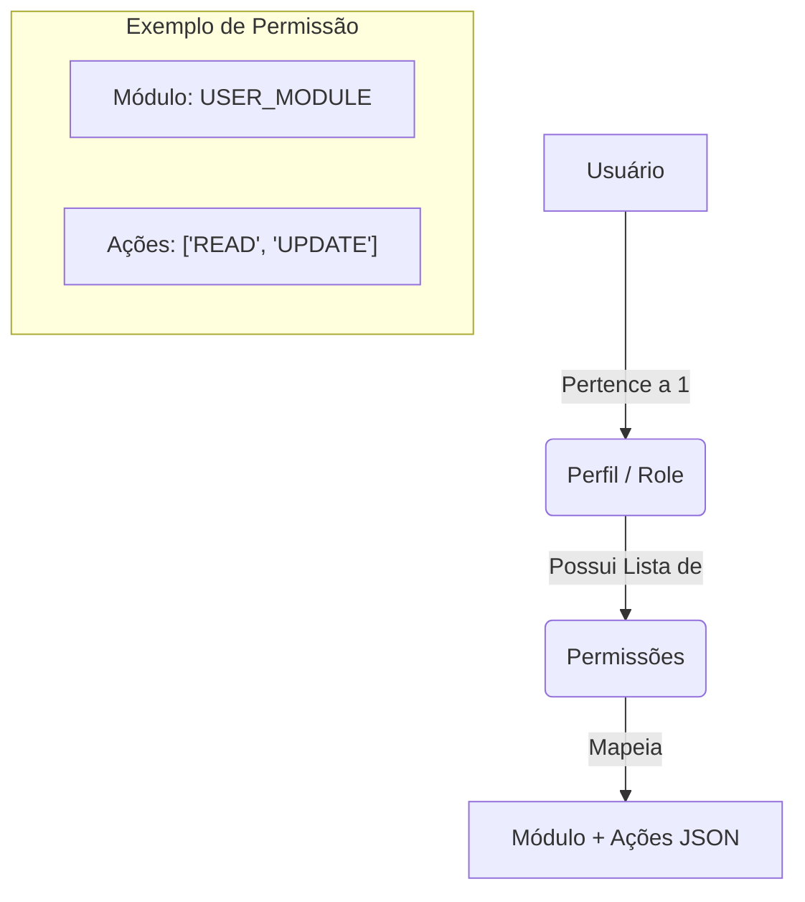

# ✅ Implementação Concluída - Refatoração RBAC (Modelo 3 Níveis)

## 📋 Resumo Final

Concluímos com sucesso a transição do sistema de controle de acesso de um modelo complexo de 9 níveis para um modelo simplificado e eficiente de **3 níveis (Usuário -> Perfil -> Permissão)**. Esta mudança reduz a carga cognitiva para o lojista e otimiza a performance do backend.

## 🎯 Entregas Realizadas

### 1. **Core e Tipagem**
- ✅ Tipagem `SimplifiedRole` e `SimplifiedPermission` implementada.
- ✅ Store `AuthStore` e `PermissionStore` sincronizados com o novo modelo direto.
- ✅ Hook `usePermissions` otimizado para busca indexada por Módulo.

### 2. **Interface de Gestão**
- ✅ **Nova Matriz de Permissões**: UI moderna onde o administrador seleciona ações (READ, CREATE, UPDATE, DELETE) por módulo.
- ✅ **Dashboard Simplificado**: Remoção de "Grupos" e "Operações" em favor de fluxos diretos.
- ✅ **Menu Dinâmico**: Sidebar reativo que oculta itens baseado no par Módulo+Ação.

### 3. **Limpeza e Manutenibilidade**
- ✅ Exclusão de 4 módulos de feature obsoletos.
- ✅ Remoção de 5 serviços de sistema que se tornaram desnecessários.
- ✅ Documentação técnica totalmente atualizada.

## 🚀 Arquitetura Atualizada

## 📊 Impacto no Ecossistema

- **Performance**: Menos 60% de JOINs nas queries de permissão SQL.
- **Bundle Size**: Redução de código morto no frontend `access-control-web`.
- **Facilidade de Venda**: O plano SaaS agora se traduz diretamente em quais módulos aparecem para o usuário, simplificando a comercialização.

---
*Documentação de encerramento da fase de refatoração do Controle de Acesso - v2.0.*