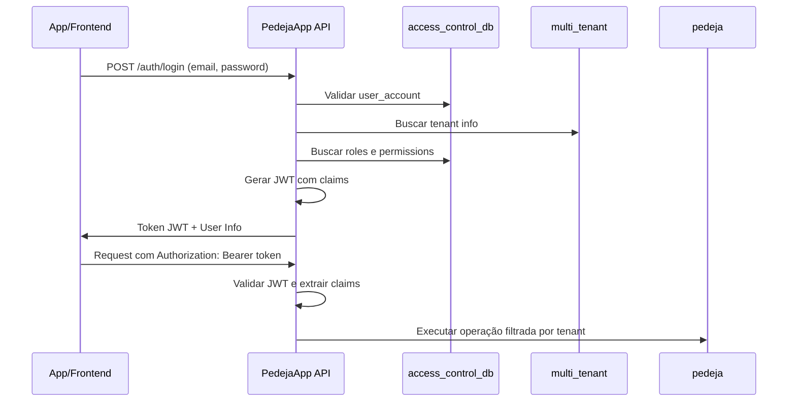

# Plano de Implementação - Sistema de Autenticação JWT

## 🎯 Objetivo

Implementar um sistema de autenticação robusto com JWT para o `pedeja-api` (sistema de delivery), integrando com as estruturas de dados já preparadas de controle de acesso e multi-tenant.

## 📋 Arquitetura de Bases de Dados

### **Estrutura Atual (3 Bases no Mesmo Servidor)**

#### 1. **Base `pedeja`** (Atual - Delivery)
- Categorias, Produtos, Pedidos, Adicionais
- Dados específicos do negócio de food delivery

#### 2. **Base `access_control_db`** (Controle de Acesso RBAC)
- `user_account` - Usuários do sistema
- `access_group` - Grupos de acesso  
- `role` - Papéis/funções
- `permission` - Permissões granulares
- `module` - Módulos/funcionalidades
- `application` - Aplicações

#### 3. **Base `multi_tenant`** (Estrutura SaaS - Futuro)
- `tenants` - Organizações/restaurantes
- `products` - Produtos da plataforma
- `subscriptions` - Assinaturas
- `plans` - Planos de assinatura

## 🔐 Sistema de Autenticação JWT

### **Fluxo de Autenticação**



### **Estrutura do JWT Token**

#### **Claims Padrão**
```json
{
  "sub": "user-uuid-here",                    // User ID
  "email": "usuario@restaurante.com",        // Email do usuário
  "tenant_id": "tenant-uuid-here",           // ID do tenant
  "tenant_slug": "pizzaria-bella",           // Slug do tenant
  "corporation_id": "corp-uuid-here",        // ID da corporation (compatibilidade)
  "roles": ["admin", "manager"],             // Roles do usuário
  "permissions": {                           // Permissões agrupadas por módulo
    "dashboard": ["read"],
    "pedidos": ["create", "read", "update"],
    "produtos": ["create", "read", "update", "delete"]
  },
  "application_id": "app-uuid-here",         // ID da aplicação
  "iss": "PedejaApp",                       // Issuer
  "aud": "pedeja-api",                      // Audience
  "iat": 1640995200,                        // Issued at
  "exp": 1640998800,                        // Expires at
  "nbf": 1640995200                         // Not before
}
```

## 🛠️ Implementação .NET

### **1. Estrutura de Projeto**

#### **Novos Projetos/Pastas**
```
PedejaApp.Authentication/          # Novo projeto para autenticação
├── Services/
│   ├── IAuthenticationService.cs
│   ├── AuthenticationService.cs
│   ├── IJwtTokenService.cs
│   └── JwtTokenService.cs
├── Models/
│   ├── LoginRequest.cs
│   ├── LoginResponse.cs
│   ├── UserClaims.cs
│   └── AuthenticationResult.cs
├── Repositories/
│   ├── IAccessControlRepository.cs
│   ├── AccessControlRepository.cs
│   ├── ITenantRepository.cs
│   └── TenantRepository.cs
└── Extensions/
    └── ServiceCollectionExtensions.cs
```

### **2. Configuração de Múltiplas Bases**

#### **appsettings.json** (Atualizado)
```json
{
  "ConnectionStrings": {
    "DefaultConnection": "server=localhost;Database=pedeja;port=5432;uid=postgres;pwd=admin;",
    "AccessControlConnection": "server=localhost;Database=access_control_db;port=5432;uid=postgres;pwd=admin;",
    "MultiTenantConnection": "server=localhost;Database=multi_tenant;port=5432;uid=postgres;pwd=admin;"
  },
  "Jwt": {
    "Key": "sua_chave_secreta_jwt_muito_segura_aqui_com_pelo_menos_256_bits",
    "Issuer": "PedejaApp",
    "Audience": "pedeja-api",
    "ExpiryMinutes": 60,
    "RefreshTokenExpiryDays": 7
  },
  "Authentication": {
    "RequireEmailConfirmation": false,
    "LockoutEnabled": true,
    "MaxFailedAttempts": 5,
    "LockoutTimeSpanMinutes": 15
  }
}
```

### **3. Contextos de Banco de Dados**

#### **AccessControlDbContext.cs**
```csharp
namespace PedejaApp.Authentication.Data;

/// <summary>
/// Contexto para a base access_control_db
/// </summary>
public class AccessControlDbContext : DbContext
{
    public AccessControlDbContext(DbContextOptions<AccessControlDbContext> options) : base(options)
    {
    }

    // Entidades do controle de acesso
    public DbSet<UserAccount> UserAccounts { get; set; }
    public DbSet<AccessGroup> AccessGroups { get; set; }
    public DbSet<Role> Roles { get; set; }
    public DbSet<Permission> Permissions { get; set; }
    public DbSet<Module> Modules { get; set; }
    public DbSet<Application> Applications { get; set; }
    public DbSet<AccountAccessGroup> AccountAccessGroups { get; set; }
    public DbSet<RoleAccessGroup> RoleAccessGroups { get; set; }
    public DbSet<PermissionOperation> PermissionOperations { get; set; }

    protected override void OnModelCreating(ModelBuilder modelBuilder)
    {
        base.OnModelCreating(modelBuilder);

        // Configurações das entidades de controle de acesso
        ConfigureAccessControlEntities(modelBuilder);
    }

    private void ConfigureAccessControlEntities(ModelBuilder modelBuilder)
    {
        // UserAccount
        modelBuilder.Entity<UserAccount>(entity =>
        {
            entity.ToTable("user_account");
            entity.HasKey(e => e.Id);
            entity.Property(e => e.Id).HasColumnName("id");
            entity.Property(e => e.CorporationId).HasColumnName("corporation_id");
        });

        // AccessGroup
        modelBuilder.Entity<AccessGroup>(entity =>
        {
            entity.ToTable("access_group");
            entity.HasKey(e => e.Id);
            entity.Property(e => e.Name).HasColumnName("name");
            entity.Property(e => e.CorporationId).HasColumnName("corporation_id");
            entity.Property(e => e.IsActive).HasColumnName("is_active");
        });

        // Role
        modelBuilder.Entity<Role>(entity =>
        {
            entity.ToTable("role");
            entity.HasKey(e => e.Id);
            entity.Property(e => e.Name).HasColumnName("name");
            entity.Property(e => e.CorporationId).HasColumnName("corporation_id");
            entity.Property(e => e.ApplicationId).HasColumnName("application_id");
            entity.Property(e => e.IsActive).HasColumnName("is_active");
        });

        // Module
        modelBuilder.Entity<Module>(entity =>
        {
            entity.ToTable("module");
            entity.HasKey(e => e.Id);
            entity.Property(e => e.Name).HasColumnName("name");
            entity.Property(e => e.ModuleKey).HasColumnName("module_key");
            entity.Property(e => e.ApplicationId).HasColumnName("application_id");
            entity.Property(e => e.IsActive).HasColumnName("is_active");
        });

        // Permission
        modelBuilder.Entity<Permission>(entity =>
        {
            entity.ToTable("permission");
            entity.HasKey(e => e.Id);
            entity.Property(e => e.RoleId).HasColumnName("role_id");
            entity.Property(e => e.ModuleId).HasColumnName("module_id");
            entity.Property(e => e.IsActive).HasColumnName("is_active");

            entity.HasOne(e => e.Role)
                .WithMany(e => e.Permissions)
                .HasForeignKey(e => e.RoleId);

            entity.HasOne(e => e.Module)
                .WithMany(e => e.Permissions)
                .HasForeignKey(e => e.ModuleId);
        });
    }
}
```

#### **MultiTenantDbContext.cs**
```csharp
namespace PedejaApp.Authentication.Data;

/// <summary>
/// Contexto para a base multi_tenant
/// </summary>
public class MultiTenantDbContext : DbContext
{
    public MultiTenantDbContext(DbContextOptions<MultiTenantDbContext> options) : base(options)
    {
    }

    // Entidades multi-tenant
    public DbSet<Tenant> Tenants { get; set; }
    public DbSet<PlatformProduct> Products { get; set; }
    public DbSet<Subscription> Subscriptions { get; set; }
    public DbSet<Plan> Plans { get; set; }

    protected override void OnModelCreating(ModelBuilder modelBuilder)
    {
        base.OnModelCreating(modelBuilder);
        ConfigureMultiTenantEntities(modelBuilder);
    }

    private void ConfigureMultiTenantEntities(ModelBuilder modelBuilder)
    {
        // Tenant
        modelBuilder.Entity<Tenant>(entity =>
        {
            entity.ToTable("tenants");
            entity.HasKey(e => e.Id);
            entity.HasIndex(e => e.Slug).IsUnique();
            entity.Property(e => e.Settings).HasColumnType("jsonb");
        });

        // Subscription
        modelBuilder.Entity<Subscription>(entity =>
        {
            entity.ToTable("subscriptions");
            entity.HasKey(e => e.Id);
            entity.HasIndex(e => new { e.TenantId, e.ProductId }).IsUnique();

            entity.HasOne(e => e.Tenant)
                .WithMany(e => e.Subscriptions)
                .HasForeignKey(e => e.TenantId);
        });
    }
}
```

### **4. Entidades de Autenticação**

#### **UserAccount.cs**
```csharp
namespace PedejaApp.Authentication.Entities;

/// <summary>
/// Entidade que representa um usuário no sistema de controle de acesso
/// </summary>
public class UserAccount
{
    /// <summary>
    /// ID único do usuário
    /// </summary>
    public Guid Id { get; set; }

    /// <summary>
    /// ID da corporation/tenant ao qual o usuário pertence
    /// </summary>
    public Guid? CorporationId { get; set; }

    /// <summary>
    /// Email do usuário (será buscado na tabela de usuários principal)
    /// </summary>
    public string Email { get; set; } = string.Empty;

    /// <summary>
    /// Hash da senha
    /// </summary>
    public string PasswordHash { get; set; } = string.Empty;

    /// <summary>
    /// Nome completo do usuário
    /// </summary>
    public string FullName { get; set; } = string.Empty;

    /// <summary>
    /// Se o usuário está ativo
    /// </summary>
    public bool IsActive { get; set; } = true;

    /// <summary>
    /// Data de criação
    /// </summary>
    public DateTime CreatedAt { get; set; } = DateTime.UtcNow;

    /// <summary>
    /// Última data de login
    /// </summary>
    public DateTime? LastLoginAt { get; set; }

    // Navigation properties
    public virtual ICollection<AccountAccessGroup> AccessGroups { get; set; } = new List<AccountAccessGroup>();
}
```

#### **AccessGroup.cs**
```csharp
namespace PedejaApp.Authentication.Entities;

/// <summary>
/// Grupo de acesso para usuários
/// </summary>
public class AccessGroup
{
    public Guid Id { get; set; }
    public string Name { get; set; } = string.Empty;
    public Guid? CorporationId { get; set; }
    public Guid? GroupTypeId { get; set; }
    public bool IsActive { get; set; } = true;
    public DateTime CreatedAt { get; set; } = DateTime.UtcNow;

    // Navigation properties
    public virtual ICollection<AccountAccessGroup> UserAccounts { get; set; } = new List<AccountAccessGroup>();
    public virtual ICollection<RoleAccessGroup> Roles { get; set; } = new List<RoleAccessGroup>();
}
```

#### **Role.cs**
```csharp
namespace PedejaApp.Authentication.Entities;

/// <summary>
/// Papel/função no sistema
/// </summary>
public class Role
{
    public Guid Id { get; set; }
    public string Name { get; set; } = string.Empty;
    public Guid? CorporationId { get; set; }
    public Guid? ApplicationId { get; set; }
    public Guid? RoleTypeId { get; set; }
    public bool IsActive { get; set; } = true;
    public DateTime CreatedAt { get; set; } = DateTime.UtcNow;

    // Navigation properties
    public virtual ICollection<Permission> Permissions { get; set; } = new List<Permission>();
    public virtual ICollection<RoleAccessGroup> AccessGroups { get; set; } = new List<RoleAccessGroup>();
}
```

### **5. Serviços de Autenticação**

#### **IAuthenticationService.cs**
```csharp
namespace PedejaApp.Authentication.Services;

/// <summary>
/// Serviço principal de autenticação
/// </summary>
public interface IAuthenticationService
{
    /// <summary>
    /// Realiza login do usuário
    /// </summary>
    Task<AuthenticationResult> LoginAsync(LoginRequest request);

    /// <summary>
    /// Atualiza token usando refresh token
    /// </summary>
    Task<AuthenticationResult> RefreshTokenAsync(string refreshToken);

    /// <summary>
    /// Realiza logout do usuário
    /// </summary>
    Task<bool> LogoutAsync(string userId);

    /// <summary>
    /// Valida se o usuário tem acesso a um módulo específico
    /// </summary>
    Task<bool> HasModuleAccessAsync(string userId, string moduleKey);

    /// <summary>
    /// Obtém permissões do usuário para um tenant específico
    /// </summary>
    Task<UserPermissions> GetUserPermissionsAsync(string userId, string tenantSlug);
}
```

#### **AuthenticationService.cs**
```csharp
namespace PedejaApp.Authentication.Services;

/// <summary>
/// Implementação do serviço de autenticação
/// </summary>
public class AuthenticationService : IAuthenticationService
{
    private readonly AccessControlDbContext _accessControlDb;
    private readonly MultiTenantDbContext _multiTenantDb;
    private readonly IJwtTokenService _jwtService;
    private readonly IPasswordHasher<UserAccount> _passwordHasher;
    private readonly ILogger<AuthenticationService> _logger;

    public AuthenticationService(
        AccessControlDbContext accessControlDb,
        MultiTenantDbContext multiTenantDb,
        IJwtTokenService jwtService,
        IPasswordHasher<UserAccount> passwordHasher,
        ILogger<AuthenticationService> logger)
    {
        _accessControlDb = accessControlDb;
        _multiTenantDb = multiTenantDb;
        _jwtService = jwtService;
        _passwordHasher = passwordHasher;
        _logger = logger;
    }

    public async Task<AuthenticationResult> LoginAsync(LoginRequest request)
    {
        try
        {
            // 1. Buscar usuário na base de controle de acesso
            var user = await _accessControlDb.UserAccounts
                .Include(u => u.AccessGroups)
                    .ThenInclude(ag => ag.AccessGroup)
                        .ThenInclude(ag => ag.Roles)
                            .ThenInclude(rag => rag.Role)
                                .ThenInclude(r => r.Permissions)
                                    .ThenInclude(p => p.Module)
                .FirstOrDefaultAsync(u => u.Email == request.Email && u.IsActive);

            if (user == null)
            {
                return AuthenticationResult.Failed("Usuário não encontrado ou inativo");
            }

            // 2. Verificar senha
            var passwordValid = _passwordHasher.VerifyHashedPassword(user, user.PasswordHash, request.Password);
            if (passwordValid == PasswordVerificationResult.Failed)
            {
                return AuthenticationResult.Failed("Senha incorreta");
            }

            // 3. Buscar informações do tenant
            Tenant? tenant = null;
            if (user.CorporationId.HasValue)
            {
                tenant = await _multiTenantDb.Tenants
                    .Include(t => t.Subscriptions)
                        .ThenInclude(s => s.Product)
                    .FirstOrDefaultAsync(t => t.Id == user.CorporationId);
            }

            // 4. Construir claims do usuário
            var userClaims = await BuildUserClaimsAsync(user, tenant);

            // 5. Gerar tokens JWT
            var accessToken = _jwtService.GenerateAccessToken(userClaims);
            var refreshToken = _jwtService.GenerateRefreshToken();

            // 6. Atualizar último login
            user.LastLoginAt = DateTime.UtcNow;
            await _accessControlDb.SaveChangesAsync();

            return AuthenticationResult.Success(new LoginResponse
            {
                AccessToken = accessToken,
                RefreshToken = refreshToken,
                ExpiresIn = 3600, // 1 hora
                User = new UserInfo
                {
                    Id = user.Id,
                    Email = user.Email,
                    FullName = user.FullName,
                    TenantId = tenant?.Id,
                    TenantName = tenant?.Name,
                    TenantSlug = tenant?.Slug
                }
            });
        }
        catch (Exception ex)
        {
            _logger.LogError(ex, "Erro durante autenticação para usuário {Email}", request.Email);
            return AuthenticationResult.Failed("Erro interno do servidor");
        }
    }

    public async Task<AuthenticationResult> RefreshTokenAsync(string refreshToken)
    {
        // Implementar lógica de refresh token
        // Validar refresh token e gerar novo access token
        throw new NotImplementedException();
    }

    public async Task<bool> LogoutAsync(string userId)
    {
        // Implementar logout (invalidar refresh token)
        return true;
    }

    public async Task<bool> HasModuleAccessAsync(string userId, string moduleKey)
    {
        var hasAccess = await _accessControlDb.UserAccounts
            .Where(u => u.Id.ToString() == userId && u.IsActive)
            .SelectMany(u => u.AccessGroups)
            .SelectMany(ag => ag.AccessGroup.Roles)
            .SelectMany(rag => rag.Role.Permissions)
            .AnyAsync(p => p.Module.ModuleKey == moduleKey && p.IsActive);

        return hasAccess;
    }

    public async Task<UserPermissions> GetUserPermissionsAsync(string userId, string tenantSlug)
    {
        // Buscar tenant
        var tenant = await _multiTenantDb.Tenants
            .FirstOrDefaultAsync(t => t.Slug == tenantSlug);

        if (tenant == null)
        {
            return new UserPermissions();
        }

        // Buscar permissões do usuário para este tenant
        var permissions = await _accessControlDb.UserAccounts
            .Where(u => u.Id.ToString() == userId && u.CorporationId == tenant.Id)
            .SelectMany(u => u.AccessGroups)
            .SelectMany(ag => ag.AccessGroup.Roles)
            .SelectMany(rag => rag.Role.Permissions)
            .Where(p => p.IsActive)
            .Select(p => new
            {
                ModuleKey = p.Module.ModuleKey,
                ModuleName = p.Module.Name,
                Operations = p.PermissionOperations.Select(po => po.Operation.Name).ToList()
            })
            .ToListAsync();

        return new UserPermissions
        {
            TenantId = tenant.Id,
            TenantSlug = tenant.Slug,
            Modules = permissions.GroupBy(p => p.ModuleKey)
                .ToDictionary(
                    g => g.Key, 
                    g => g.SelectMany(p => p.Operations).Distinct().ToList()
                )
        };
    }

    private async Task<UserClaims> BuildUserClaimsAsync(UserAccount user, Tenant? tenant)
    {
        var roles = new List<string>();
        var modulePermissions = new Dictionary<string, List<string>>();

        // Buscar roles e permissões do usuário
        foreach (var accessGroup in user.AccessGroups.Where(ag => ag.AccessGroup.IsActive))
        {
            foreach (var roleGroup in accessGroup.AccessGroup.Roles.Where(rag => rag.Role.IsActive))
            {
                roles.Add(roleGroup.Role.Name);

                foreach (var permission in roleGroup.Role.Permissions.Where(p => p.IsActive))
                {
                    var moduleKey = permission.Module.ModuleKey;
                    var operations = permission.PermissionOperations
                        .Select(po => po.Operation.Name.ToLower())
                        .ToList();

                    if (!modulePermissions.ContainsKey(moduleKey))
                    {
                        modulePermissions[moduleKey] = new List<string>();
                    }

                    modulePermissions[moduleKey].AddRange(operations);
                }
            }
        }

        return new UserClaims
        {
            UserId = user.Id,
            Email = user.Email,
            FullName = user.FullName,
            TenantId = tenant?.Id,
            TenantSlug = tenant?.Slug,
            CorporationId = user.CorporationId,
            Roles = roles.Distinct().ToList(),
            Permissions = modulePermissions.ToDictionary(
                kvp => kvp.Key,
                kvp => kvp.Value.Distinct().ToList()
            )
        };
    }
}
```

### **6. Serviço JWT**

#### **IJwtTokenService.cs**
```csharp
namespace PedejaApp.Authentication.Services;

/// <summary>
/// Serviço para geração e validação de tokens JWT
/// </summary>
public interface IJwtTokenService
{
    /// <summary>
    /// Gera um access token JWT
    /// </summary>
    string GenerateAccessToken(UserClaims userClaims);

    /// <summary>
    /// Gera um refresh token
    /// </summary>
    string GenerateRefreshToken();

    /// <summary>
    /// Valida um token JWT
    /// </summary>
    ClaimsPrincipal? ValidateToken(string token);

    /// <summary>
    /// Extrai claims do token
    /// </summary>
    UserClaims? GetUserClaimsFromToken(string token);
}
```

#### **JwtTokenService.cs**
```csharp
namespace PedejaApp.Authentication.Services;

/// <summary>
/// Implementação do serviço JWT
/// </summary>
public class JwtTokenService : IJwtTokenService
{
    private readonly IConfiguration _configuration;
    private readonly ILogger<JwtTokenService> _logger;
    private readonly byte[] _key;

    public JwtTokenService(IConfiguration configuration, ILogger<JwtTokenService> logger)
    {
        _configuration = configuration;
        _logger = logger;
        _key = Encoding.UTF8.GetBytes(_configuration["Jwt:Key"]!);
    }

    public string GenerateAccessToken(UserClaims userClaims)
    {
        var tokenHandler = new JwtSecurityTokenHandler();
        
        var claims = new List<Claim>
        {
            new(JwtRegisteredClaimNames.Sub, userClaims.UserId.ToString()),
            new(JwtRegisteredClaimNames.Email, userClaims.Email),
            new(JwtRegisteredClaimNames.Jti, Guid.NewGuid().ToString()),
            new("full_name", userClaims.FullName),
        };

        // Adicionar claims do tenant
        if (userClaims.TenantId.HasValue)
        {
            claims.Add(new("tenant_id", userClaims.TenantId.Value.ToString()));
        }

        if (!string.IsNullOrEmpty(userClaims.TenantSlug))
        {
            claims.Add(new("tenant_slug", userClaims.TenantSlug));
        }

        if (userClaims.CorporationId.HasValue)
        {
            claims.Add(new("corporation_id", userClaims.CorporationId.Value.ToString()));
        }

        // Adicionar roles
        foreach (var role in userClaims.Roles)
        {
            claims.Add(new(ClaimTypes.Role, role));
        }

        // Adicionar permissões como JSON
        if (userClaims.Permissions.Any())
        {
            var permissionsJson = JsonSerializer.Serialize(userClaims.Permissions);
            claims.Add(new("permissions", permissionsJson));
        }

        var tokenDescriptor = new SecurityTokenDescriptor
        {
            Subject = new ClaimsIdentity(claims),
            Expires = DateTime.UtcNow.AddMinutes(_configuration.GetValue<int>("Jwt:ExpiryMinutes", 60)),
            Issuer = _configuration["Jwt:Issuer"],
            Audience = _configuration["Jwt:Audience"],
            SigningCredentials = new SigningCredentials(new SymmetricSecurityKey(_key), SecurityAlgorithms.HmacSha256Signature)
        };

        var token = tokenHandler.CreateToken(tokenDescriptor);
        return tokenHandler.WriteToken(token);
    }

    public string GenerateRefreshToken()
    {
        var randomNumber = new byte[32];
        using var rng = RandomNumberGenerator.Create();
        rng.GetBytes(randomNumber);
        return Convert.ToBase64String(randomNumber);
    }

    public ClaimsPrincipal? ValidateToken(string token)
    {
        try
        {
            var tokenHandler = new JwtSecurityTokenHandler();
            var validationParameters = new TokenValidationParameters
            {
                ValidateIssuerSigningKey = true,
                IssuerSigningKey = new SymmetricSecurityKey(_key),
                ValidateIssuer = true,
                ValidIssuer = _configuration["Jwt:Issuer"],
                ValidateAudience = true,
                ValidAudience = _configuration["Jwt:Audience"],
                ValidateLifetime = true,
                ClockSkew = TimeSpan.Zero
            };

            var principal = tokenHandler.ValidateToken(token, validationParameters, out var validatedToken);
            return principal;
        }
        catch (Exception ex)
        {
            _logger.LogWarning(ex, "Token validation failed");
            return null;
        }
    }

    public UserClaims? GetUserClaimsFromToken(string token)
    {
        var principal = ValidateToken(token);
        if (principal == null) return null;

        var userIdClaim = principal.FindFirst(JwtRegisteredClaimNames.Sub)?.Value;
        if (string.IsNullOrEmpty(userIdClaim) || !Guid.TryParse(userIdClaim, out var userId))
        {
            return null;
        }

        var tenantIdClaim = principal.FindFirst("tenant_id")?.Value;
        var corporationIdClaim = principal.FindFirst("corporation_id")?.Value;
        var permissionsClaim = principal.FindFirst("permissions")?.Value;

        Dictionary<string, List<string>>? permissions = null;
        if (!string.IsNullOrEmpty(permissionsClaim))
        {
            try
            {
                permissions = JsonSerializer.Deserialize<Dictionary<string, List<string>>>(permissionsClaim);
            }
            catch (Exception ex)
            {
                _logger.LogWarning(ex, "Failed to deserialize permissions from token");
            }
        }

        return new UserClaims
        {
            UserId = userId,
            Email = principal.FindFirst(JwtRegisteredClaimNames.Email)?.Value ?? "",
            FullName = principal.FindFirst("full_name")?.Value ?? "",
            TenantId = Guid.TryParse(tenantIdClaim, out var tenantId) ? tenantId : null,
            TenantSlug = principal.FindFirst("tenant_slug")?.Value,
            CorporationId = Guid.TryParse(corporationIdClaim, out var corporationId) ? corporationId : null,
            Roles = principal.FindAll(ClaimTypes.Role).Select(c => c.Value).ToList(),
            Permissions = permissions ?? new Dictionary<string, List<string>>()
        };
    }
}
```

### **7. Controllers de Autenticação**

#### **AuthController.cs**
```csharp
namespace PedejaApp.Web.Controllers;

/// <summary>
/// Controller para autenticação e autorização
/// </summary>
[ApiController]
[Route("api/[controller]")]
public class AuthController : ControllerBase
{
    private readonly IAuthenticationService _authService;
    private readonly ILogger<AuthController> _logger;

    public AuthController(IAuthenticationService authService, ILogger<AuthController> logger)
    {
        _authService = authService;
        _logger = logger;
    }

    /// <summary>
    /// Realizar login no sistema
    /// </summary>
    [HttpPost("login")]
    public async Task<ActionResult<ApiResponse<LoginResponse>>> Login([FromBody] LoginRequest request)
    {
        try
        {
            if (!ModelState.IsValid)
            {
                return BadRequest(ApiResponse<LoginResponse>.ErrorResponse("Dados inválidos"));
            }

            var result = await _authService.LoginAsync(request);

            if (!result.Success)
            {
                return Unauthorized(ApiResponse<LoginResponse>.ErrorResponse(result.ErrorMessage!));
            }

            return Ok(ApiResponse<LoginResponse>.SuccessResponse(result.Data!, "Login realizado com sucesso"));
        }
        catch (Exception ex)
        {
            _logger.LogError(ex, "Erro durante login para {Email}", request.Email);
            return StatusCode(500, ApiResponse<LoginResponse>.ErrorResponse("Erro interno do servidor"));
        }
    }

    /// <summary>
    /// Renovar token usando refresh token
    /// </summary>
    [HttpPost("refresh-token")]
    public async Task<ActionResult<ApiResponse<LoginResponse>>> RefreshToken([FromBody] RefreshTokenRequest request)
    {
        try
        {
            var result = await _authService.RefreshTokenAsync(request.RefreshToken);

            if (!result.Success)
            {
                return Unauthorized(ApiResponse<LoginResponse>.ErrorResponse(result.ErrorMessage!));
            }

            return Ok(ApiResponse<LoginResponse>.SuccessResponse(result.Data!, "Token renovado com sucesso"));
        }
        catch (Exception ex)
        {
            _logger.LogError(ex, "Erro durante renovação de token");
            return StatusCode(500, ApiResponse<LoginResponse>.ErrorResponse("Erro interno do servidor"));
        }
    }

    /// <summary>
    /// Realizar logout
    /// </summary>
    [HttpPost("logout")]
    [Authorize]
    public async Task<ActionResult<ApiResponse<bool>>> Logout()
    {
        try
        {
            var userId = User.FindFirst(JwtRegisteredClaimNames.Sub)?.Value;
            if (string.IsNullOrEmpty(userId))
            {
                return BadRequest(ApiResponse<bool>.ErrorResponse("Token inválido"));
            }

            var success = await _authService.LogoutAsync(userId);

            return Ok(ApiResponse<bool>.SuccessResponse(success, "Logout realizado com sucesso"));
        }
        catch (Exception ex)
        {
            _logger.LogError(ex, "Erro durante logout");
            return StatusCode(500, ApiResponse<bool>.ErrorResponse("Erro interno do servidor"));
        }
    }

    /// <summary>
    /// Obter informações do usuário atual
    /// </summary>
    [HttpGet("me")]
    [Authorize]
    public ActionResult<ApiResponse<UserInfo>> GetCurrentUser()
    {
        try
        {
            var userInfo = new UserInfo
            {
                Id = Guid.Parse(User.FindFirst(JwtRegisteredClaimNames.Sub)?.Value!),
                Email = User.FindFirst(JwtRegisteredClaimNames.Email)?.Value!,
                FullName = User.FindFirst("full_name")?.Value!,
                TenantSlug = User.FindFirst("tenant_slug")?.Value
            };

            if (Guid.TryParse(User.FindFirst("tenant_id")?.Value, out var tenantId))
            {
                userInfo.TenantId = tenantId;
            }

            return Ok(ApiResponse<UserInfo>.SuccessResponse(userInfo, "Informações do usuário recuperadas"));
        }
        catch (Exception ex)
        {
            _logger.LogError(ex, "Erro ao recuperar informações do usuário");
            return StatusCode(500, ApiResponse<UserInfo>.ErrorResponse("Erro interno do servidor"));
        }
    }

    /// <summary>
    /// Verificar se usuário tem acesso a um módulo
    /// </summary>
    [HttpGet("check-access/{moduleKey}")]
    [Authorize]
    public async Task<ActionResult<ApiResponse<bool>>> CheckModuleAccess(string moduleKey)
    {
        try
        {
            var userId = User.FindFirst(JwtRegisteredClaimNames.Sub)?.Value;
            if (string.IsNullOrEmpty(userId))
            {
                return BadRequest(ApiResponse<bool>.ErrorResponse("Token inválido"));
            }

            var hasAccess = await _authService.HasModuleAccessAsync(userId, moduleKey);

            return Ok(ApiResponse<bool>.SuccessResponse(hasAccess, 
                hasAccess ? "Acesso permitido" : "Acesso negado"));
        }
        catch (Exception ex)
        {
            _logger.LogError(ex, "Erro ao verificar acesso ao módulo {ModuleKey}", moduleKey);
            return StatusCode(500, ApiResponse<bool>.ErrorResponse("Erro interno do servidor"));
        }
    }
}
```

### **8. Configuração e Injeção de Dependências**

#### **Program.cs** (Configuração)
```csharp
using PedejaApp.Authentication.Extensions;

var builder = WebApplication.CreateBuilder(args);

// Adicionar contextos de banco de dados
builder.Services.AddDbContext<ApplicationDbContext>(options =>
    options.UseNpgsql(builder.Configuration.GetConnectionString("DefaultConnection")));

builder.Services.AddDbContext<AccessControlDbContext>(options =>
    options.UseNpgsql(builder.Configuration.GetConnectionString("AccessControlConnection")));

builder.Services.AddDbContext<MultiTenantDbContext>(options =>
    options.UseNpgsql(builder.Configuration.GetConnectionString("MultiTenantConnection")));

// Adicionar autenticação JWT
builder.Services.AddAuthenticationServices(builder.Configuration);

// Adicionar autorização
builder.Services.AddAuthorization(options =>
{
    options.AddPolicy("RequireValidTenant", policy =>
        policy.RequireClaim("tenant_id"));
    
    options.AddPolicy("AdminOnly", policy =>
        policy.RequireRole("admin"));
});

var app = builder.Build();

// Configurar pipeline
app.UseAuthentication();
app.UseAuthorization();

app.MapControllers();

app.Run();
```

## 📋 Plano de Execução

### **Fase 1: Setup da Estrutura (2-3 dias)**
1. ✅ Criar projeto PedejaApp.Authentication
2. ✅ Configurar múltiplas conexões de banco
3. ✅ Implementar contextos de banco (AccessControl, MultiTenant)
4. ✅ Criar entidades principais

### **Fase 2: Implementação dos Serviços Core (3-4 dias)**
1. ✅ Implementar AuthenticationService
2. ✅ Implementar JwtTokenService
3. ✅ Criar repositórios de acesso
4. ✅ Configurar injeção de dependências

### **Fase 3: Controllers e APIs (2-3 dias)**
1. ✅ Implementar AuthController
2. ✅ Criar DTOs e modelos de request/response
3. ✅ Implementar middleware de autenticação
4. ✅ Configurar autorização por políticas

### **Fase 4: Integração com Dados Existentes (2-3 dias)**
1. ✅ Popular tabelas de controle de acesso
2. ✅ Criar dados de teste para multi-tenant
3. ✅ Configurar applications e modules
4. ✅ Testes de integração

### **Fase 5: Testes e Validação (2-3 dias)**
1. ✅ Testes unitários dos serviços
2. ✅ Testes de integração das APIs
3. ✅ Validação de segurança JWT
4. ✅ Testes de performance

## 🔒 Segurança Implementada

### **✅ Autenticação Robusta**
- Validação de senha com hash bcrypt
- Tokens JWT com tempo de expiração
- Refresh tokens para renovação segura
- Controle de tentativas de login

### **✅ Autorização Granular**
- RBAC baseado na estrutura existente
- Permissões por módulo e operação
- Filtros automáticos por tenant
- Políticas de autorização flexíveis

### **✅ Isolamento de Dados**
- Claims JWT com tenant_id
- Validação de acesso por tenant
- Filtros automáticos nas queries
- Auditoria de acessos

## 🚀 Benefícios

### **✅ Compatibilidade Total**
- Usa estrutura de controle de acesso existente
- Integra com dados multi-tenant preparados
- Mantém compatibilidade com futuras expansões

### **✅ Escalabilidade**
- Suporte a múltiplos tenants
- Cache de permissões
- Tokens estateless (JWT)

### **✅ Segurança**
- Autenticação multi-fator preparada
- Refresh tokens seguros
- Controle granular de permissões

---

**Status**: 📋 **Pronto para Implementação**  
**Data**: Setembro 2025  
**Responsável**: Samuel (Agente de Desenvolvimento)  
**Tecnologias**: .NET 9, JWT, PostgreSQL (3 bases), RBAC