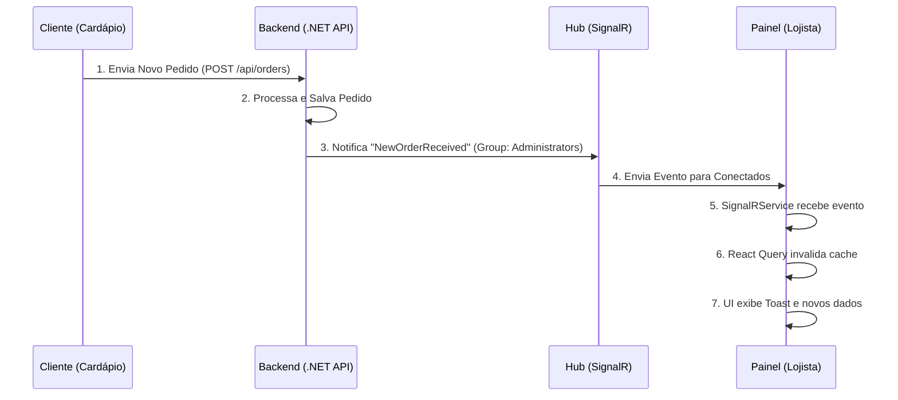

# Arquitetura de Tempo Real (SignalR)

Este documento descreve a implementação de atualizações em tempo real no **Opamenu Painel**, permitindo que lojistas recebam pedidos e mudanças de status instantaneamente sem a necessidade de recarregar a página (F5) ou aguardar o ciclo de polling.

## 🔄 Visão Geral do Fluxo

O sistema utiliza **WebSockets** (via SignalR) para estabelecer um canal bidirecional entre o Backend (.NET) e o Frontend (React).



## 🛠 Componentes Envolvidos

### 1. Backend (`OrderNotificationHub.cs`)
Hub responsável por gerenciar conexões e grupos.
- **Endpoint**: `/hubs/notifications`
- **Grupos**:
    - `Administrators`: Recebe todos os novos pedidos (usado pelo Painel).
    - `Order_{id}`: Recebe atualizações de um pedido específico (usado pelo Cliente).

### 2. Frontend Service (`signalr.service.ts`)
Singleton que gerencia a conexão WebSocket no Painel.
- **Localização**: `src/services/signalr.service.ts`
- **Funcionalidades**:
    - Conexão automática ao logar.
    - Reconexão automática em caso de queda (`withAutomaticReconnect`).
    - Inscrição automática no grupo de administradores (`JoinAdminGroup`).
    - Sistema de eventos (`on/off`) para componentes React.

### 3. Integração na UI

#### Layout Global (`DashboardLayout.tsx`)
Mantém a conexão viva enquanto o usuário estiver logado.
```typescript
useEffect(() => {
  if (isAuthenticated && accessToken) {
    signalRService.connect(accessToken);
  }
  return () => signalRService.disconnect();
}, [isAuthenticated, accessToken]);
```

#### Página de Pedidos (`OrdersPage.tsx`)
Ouve os eventos e atualiza a lista.
```typescript
useEffect(() => {
    signalRService.on("NewOrderReceived", (data) => {
        toast({ title: "Novo Pedido!", description: `Pedido #${data.orderId}` });
        queryClient.invalidateQueries({ queryKey: ["orders"] });
    });
}, []);
```

## 🛡 Mecanismos de Fallback

Para garantir robustez, o sistema mantém uma estratégia híbrida:
1.  **Tempo Real (Primário)**: Atualização instantânea via WebSocket.
2.  **Polling (Secundário)**: O `useQuery` continua configurado para buscar dados a cada **30 segundos**. Isso garante que, se o WebSocket falhar ou for bloqueado por firewall, o lojista ainda receberá os pedidos com um pequeno atraso.

## 🚀 Como Testar

1.  Abra o **Opamenu Painel** e vá para a tela de Pedidos.
2.  Abra o **Opamenu Cardápio** (em outra aba ou dispositivo) e finalize um pedido.
3.  Observe que o Painel exibirá um alerta "Novo Pedido!" e o card aparecerá na coluna "Pendente" instantaneamente, sem reload.
